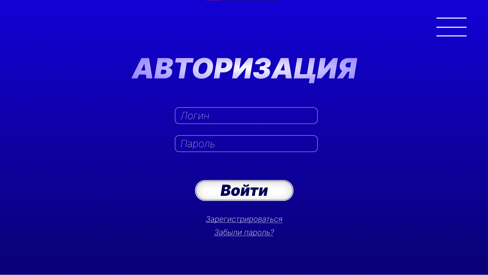
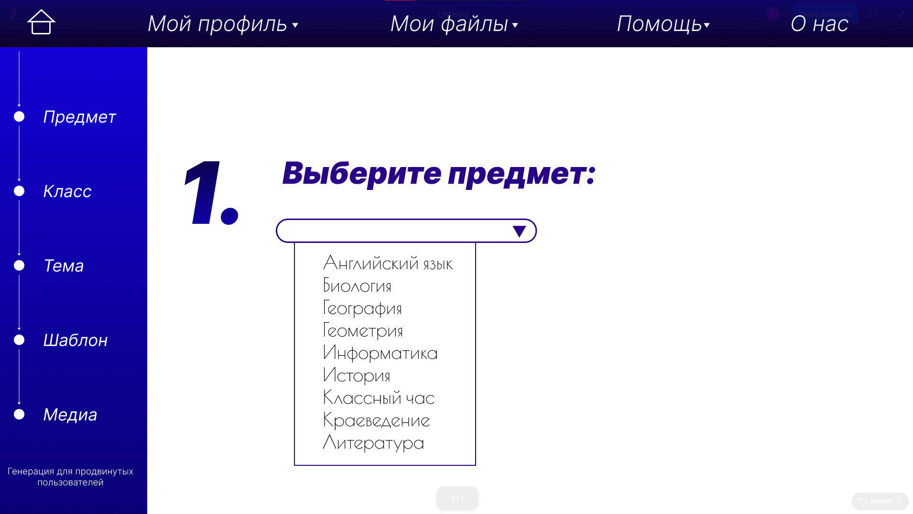
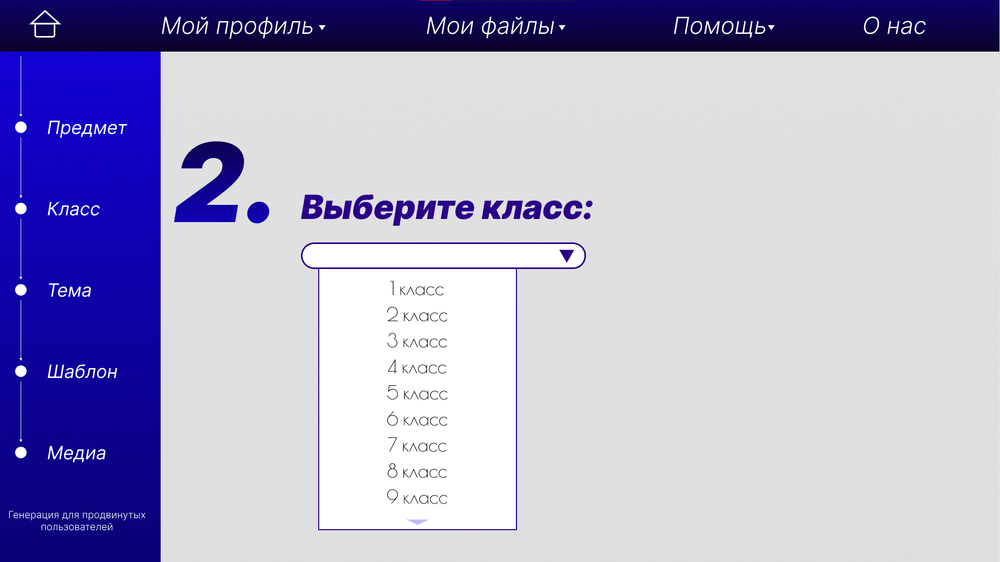
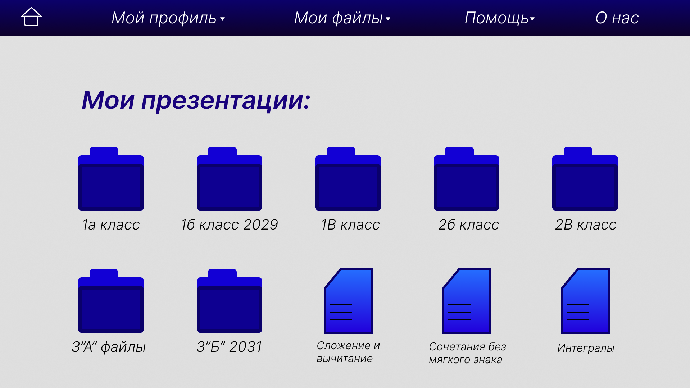
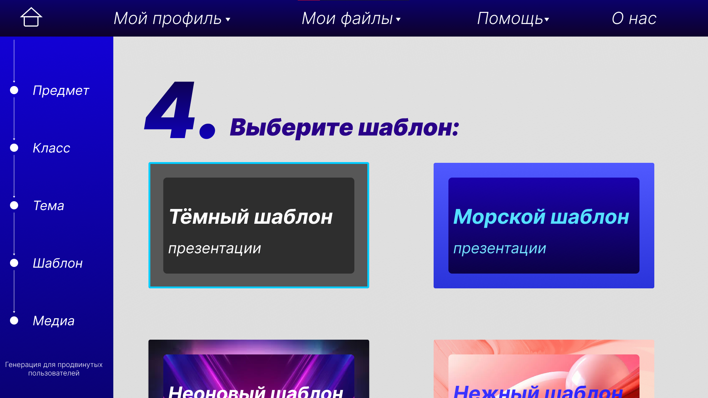

# Cервис автоматической генерации презентаций с ИИ

## 🎯 Идея

Создать интеллектуальный сервис для автоматической генерации презентаций, который позволяет пользователям быстро и легко создавать качественные материалы для выступлений, учебы или работы.

Основная цель — упростить процесс создания презентаций, предоставив пользователю интуитивно понятные инструменты для генерации и кастомизации контента с помощью искусственного интеллекта.

## 🚀 Ключевые возможности

*   **✨ Конструктор промптов:** Вместо сложного текстового ввода мы предлагаем структурированный конструктор. Вы можете легко задать параметры презентации, выбрав класс, предмет, стиль изложения, язык, а также указав тему и краткое описание.

*   **🎨 AI-редактор слайдов:** Редактируйте сгенерированные слайды с помощью текстовых команд. Просто опишите, что нужно изменить (например, «сделай текст более формальным» или «добавь изображение по теме»), и ИИ внесет правки.

*   **🖼️ Загрузка собственных изображений:** Персонализируйте свои презентации, добавляя собственные изображения на любой слайд.

*   **📝 Генерация заметок для спикера:** К каждому слайду автоматически создается текст выступления, основанный на его содержимом. Это поможет вам уверенно провести презентацию.

*   **🤖 Выбор AI-модели:** В настройках профиля вы можете выбрать одну из нескольких доступных языковых моделей для генерации контента, подбирая оптимальный вариант под ваши задачи.

*   **👤 Пользовательские аккаунты:** Простая регистрация для доступа ко всем возможностям сервиса и управления вашими проектами.

*   **🪙 Гибкая тарификация:** Система работает на основе токенов. Вы приобретаете пакет токенов и тратите их на генерацию презентаций. Мы также предоставляем возможность бесплатной перегенерации отдельных слайдов или всей презентации в случае необходимости.

## 🏗 Технологический стек

*   **Backend:** FastAPI (Python)
*   **Frontend:** Next.js (React + TypeScript)
*   **База данных:** PostgreSQL
*   **Контейнеризация:** Docker (с поддержкой GPU для локальных моделей)
*   **LLM-интеграция:** OpenRouter (Единый API для LLM)

## 💡 Вдохновение

За основу был взят инструмент Presenton, который предоставляет следующие возможности:

*   ✅ Генерация шаблонов с искусственным интеллектом из существующих документов Powerpoint.
*   ✅ Гибкая генерация презентаций на основе подсказок или загруженных документов.
*   ✅ Экспорт в форматы PowerPoint (PPTX) и PDF с профессиональным форматированием.
*   ✅ Работа в облаке без необходимости скачивания дополнительного ПО.

## Концепт интерфейса

### Авторизация

### Выбор предмета

### Выбор класса 

### Архив презентаций

### Выбор шаблона темы 

